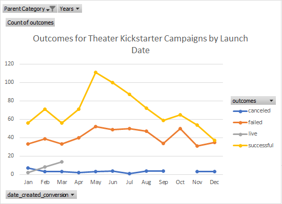
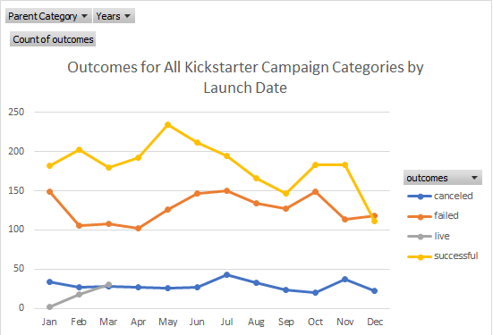
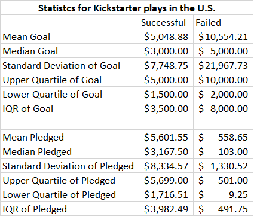
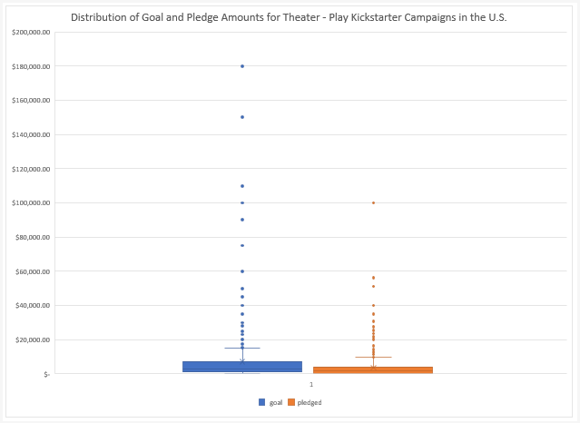

# kickstarter-analysis
Performing analysis on Kickstarter data to uncover trends
#Kickstarting with Excel

## Overview of the project

This project analyzes Kickstarter data from 2009-2017 to help an up-and-coming playwright figure out how to plan a successful Kickstarter campaign. 
The playwright is planning on launching her play, "Fever," in the United States with a budget of more than $10,000 and is hesitant about jumping into her first crowdfunding campaign. 
Using an analysis of a dataset of Kickstarter campaigns, I outline some recommendations for the playwright, including advice for when to launch her campaign and how much money she should plan to fundraise.

### Purpose

The purpose of this project is to help a playwright understand trends on Kickstarter to help her determine whether there are specific factors that make a project campaign successful. 
The project is intended to inform and guide the playwright's decisions as she plans her Kickstarter campaign.

## Analysis and Challenges

Using pivot tables and statistical analyses in Excel, I analyzed the Kickstarter campaign data. 
Through the investigation, I determined that theater campaigns are, overall, successful and popular.
As you will see in the following analyses, there is a spike in the number of successful campaigns in May that declines toward the end of the year. 
I also discovered that failed Kickstarter campaigns tend to have much higher fundraising goals than successful ones. 
During my work, I also experienced some challenges with using excel and the data set that are also discussed in this section.

### Analysis of Outcomes Based on Launch Data

Out of 1,651 successful Kickstarter campaigns launched in the United States, 525 theater campaigns were successful -- the highest of any category. 
Theater was followed by campaigns that fell in the music and film and video categories.

 

Looking at the outcomes of theater campaigns based on launch data, we can see a high number of successful campaigns in May that dropped as the year went on. There was also a spike in failed campaigns in October, and fairly low canceled campaigns throughout the year. 

An examination of outcomes for all categories of Kickstarter campaigns by launch date reveals a spike in successful campaigns around May that then increases in October, plateauing through November, and steeply dropping until December. 

Based on these two graphs, anyone planning on launching a theater campaign might want to start in May and or June. 

### Analysis of Outcomes Based on Goals

The playwright's goal of launching a play with a budget of more than $10,000 in the United States, may not be the most advisable, given she is planning on asking for more than double the average of the successful Kickstarter goal and only $500 less than the average failed goal.

 
However, the mean and median pledged amounts along with the upper and lower quartile of pledged amounts are much smaller than the successful pledges, which may show that unsuccessful Kickstarter campaigns failed for reasons other than asking for too much money. 
The interquartile ranges for the data show that there are some outliers in the data set as well. Standard deviations are almost twice the interquartile range for every distribution, except for the failed Kickstarter, where the standard deviation is closer to three times the interquartile range. 
As the box and whisker plot of the distribution of goal and pledge amounts for theater Kickstarter campaigns in the U.S. also shows, there were some high requests for funding that are driving the distributions. 

### Challenges and Difficulties Encountered

Some of the challenges that I navigated through this project included Excel slowdowns because of the size of the data and an occasional issue where I forgot to unfreeze a column or accidentally put in the wrong formula.
 I also struggled with wanting to have access to more information indicating what might be shaping the results I found, which I detail further in my results section. I also had to remember to unfilter and clean up some of the data during my analysis.

## Results

In the United States, out of 925 launched theater campaigns, about 58% were successful. 
The $10,000 the playwright is planning on requesting is more than double the average budget of successful campaigns and may indicate that she might want to reduce her funding goals. 
My analysis also shows that the most successful campaigns launched in May, which might be an excellent time to launch her campaign. 
Though my analysis indicates that $10,000 might not be a successful request, as I discussed in the "Analysis of Outcomes Based on Goals," the mean and median pledged amounts along with the upper and lower quartile of pledged amounts are much lower than the successful pledges. 
This information shows that unsuccessful Kickstarter campaigns may have failed for reasons other than asking for too much money. 
My data is limited, however, and I cannot provide much insight into why Kickstarter campaigns failed. Other directions that this research might include looking at whether the length of the name of a play shaped whether a campaign was successful or not, how numbers of backers may indicate the success of a campaign and what whether "staff picks" of campaigns actually helped a campaign. Given more data, I would love to explore the factors behind increasing numbers of backers and who backed a campaign -- strangers or those close to the creator of the campaign. 