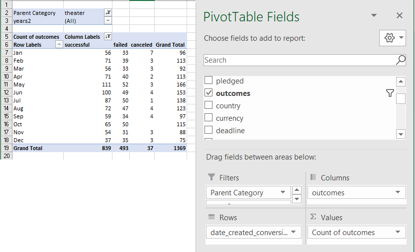
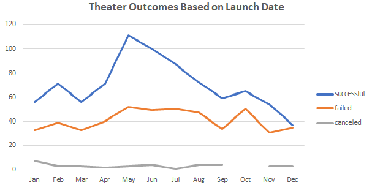
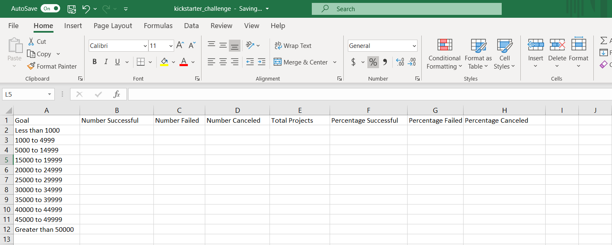
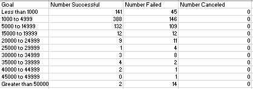
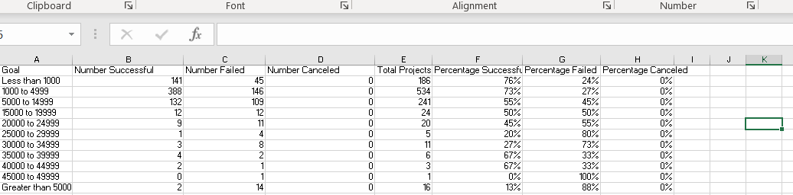
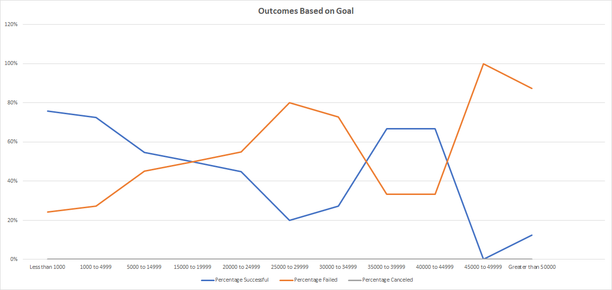
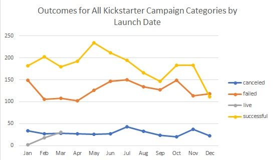

# Kickstarting with Excel Challenge

## Overview of Project

This project uses Excel to analyze Kickstarter data from 2009-2017 to help a playwright who recently completed a Kickstarter fundraising campaign understand how theater campaigns fared in relation to their launch dates and what outcomes play production campaigns met based on the amount of money they sought to raise. 
As part of the analysis, I outline some observations based on an analysis of the outcomes of campaigns' launch date and goals.

### Purpose

The purpose of this project is to help a playwright understand trends for theater campaigns on Kickstarter to help her determine how different theater campaigns fared in relation to their launch dates and to see how funding goals related to the success of a play production campaign on Kickstarter.

## Analysis and Challenges

Using pivot tables and formulas in Excel, I analyzed the Kickstarter campaign data for playwriting campaigns. 
Through the investigation, I saw that campaigns launched in May were more successful and that successful Kickstarter campaigns peaked as a percentage at less than $1,000. 
Included in this section is an explanation of how I performed my analysis and explanations of code, followed by a section detailing the challenges I encountered and how I overcame them.

### Analysis of Outcomes Based on Launch Date

To analyze the outcome of a theater campaign based on the year it launched, I need to first extract the years of the campaign.
To do so, I created a new column and used the `YEAR()` formula to pull the year the campaign launched from the date of the launched campaign (this date was created by converting the UNIX TIMESTAMP included in the original data).
Once I created the new table, I created a pivot table using the data and filtered by the theater category and the new "years" category. I did a count of all the outcomes and sorted by month (see image below).



I then removed the "live" outcomes (or ongoing campaigns) with the filter option in the pivot table  because it was not relevant to my analysis and sorted the columns so that the order was what I wanted to display.

After creating the pivot table, I then visualized the data with a line graph. 
Because I was curious, I also graphed the outcomes for all Kickstarter campaign categories by launch date and included the "live" campaigns to see if anything noteworthy might appear.



Though I go into an explanation in the results section, I would say that looking at the outcomes of theater campaigns based on launch data, we can see a high number of successful campaigns in May that dropped as the year went on. 
There was also a spike in failed campaigns in October, and fairly low canceled campaigns throughout the year. 

An examination of outcomes for all categories of Kickstarter campaigns by launch date also reveals a spike in successful campaigns around May that then increases in October, plateauing through November, and steeply dropping into December.

[IMAGE OF ALL CATEGORIES]

Based on these two graphs, anyone planning on launching a theater campaign might want to start in May, but if I had more time, I would have liked to dive more into what might explain this trend.

### Analysis of Outcomes Based on Goals

To analyze the outcome of play production campaigns based on goals, I first created a new sheet and then columns and rows containing labels for the information that I wanted to know.



To populate the counts, I knew I needed to use the `COUNTSIF()` formula, but I had never used it before, so I watched the video that accompanied the instructional challenge and learned that `COUNTSIF()` is conditional and I just needed to put in the parameters I wanted to examine. 
So, I stipulated whether something was successful, met the goal of x, and fell into the subcategory of plays with this formula:

```=COUNTIFS(Kickstarter!F:F,"successful",Kickstarter!D:D,"<1000",Kickstarter!U:U,"plays") ```

For each column, I replaced the "successful" with the relevant category I wanted counted and set up the parameters for whether I wanted something to be greater, equal to etc, keeping the "plays" category the same every time.



When I saw that the counts for canceled campaigns were "0" across the board, I went back to the original Kickstarter data to filter and did not see any "canceled" categories for plays, thereby confirming the numbers that I had calculated. 

To calculate the percentage of success for each category, I created a new column where I summed up the the total projects per category and then found the percentage successful, failed and canceled projects by dividing the count of successful, failed and canceled by the total projects for a category.



I then graphed the results. The following graph  shows that the number of successful outcomes for play production Kickstarter campaigns peaked as a percentage at less than $1,000 and was least successful when it tried to raise between $45,000 and $49,999. 



There is more to discuss in the results section, but I wanted to make a couple quick observations before moving into the challenges and difficulties section.

### Challenges and Difficulties Encountered

The first time I used the `YEAR()` formula, I got the year 1905. Unsure of what to do, I googled the answer and ended up on [Excel Forum Help](https://www.excelforum.com/excel-general/351291-year-function-does-not-work.html). 
According to the help section, I had the "years" column I had just created, set to "date" when it needed to be set to "general" because of how dates are stored.

I also had difficulty rearranging the columns in the pivot table to get them where I wanted, but then after playing with another pivot table I created in a separate sheet, I realized that I could drag and drop the columns into positions where I wanted them.

The `COUNTIFS()` formula was probably the most challenging aspect of this assignment. The video helped me understand the basics of the formula, but it wasn't until I played around with it in a separate file that I understood how to set up the formula and needed to add in the second parameter in the formula. 
For example, to set up the 5,000 to 14,999 category I needed to set it up this way:

``` =COUNTIFS(Kickstarter!F:F,"successful",**Kickstarter!D:D,">=5000"**,**Kickstarter!D:D,"<=14999"**,Kickstarter!U:U,"plays")```

## Results

Looking at the graph of theater outcomes based on launch data, we can visually see a high number of successful campaigns in May that decreased as the year went on. 


There was also a spike in failed campaigns in October, and fairly low canceled campaigns throughout the year. 

As I noted earlier in the analysis section as well, an examination of outcomes for all categories of Kickstarter campaigns by launch date also reveals a spike in successful campaigns around May that then increases in October, plateauing through November, and steeply dropping into December. 



These two visuals indicate that May might be a good time to launch a theater Kickstarter campaign. 

Another interesting find is that March had the least amount of campaigns launched as we as one of the lowest counts failed campaigns for theater outcomes based on launch date (after November).
That might be because people are not launching during that time and could be a month to potentially start launching campaigns to take advantage of a gap in the market.
More time to explore that piece of information might be helpful for the question we are trying to answer.

Overall, with about 59% of campaigns marked as "successful," theater Kickstarter campaigns seem to be useful and popular.

However, our data is limited in that we do not know why the trends I pointed out exist and what might cause them. It could be that with taxes, holidays and holiday spending, people are less likely to spend their money on a Kickstarter campaign heading into the holiday period, but that would just be a hypothesis. 
We also do not break down the categories into specific types of plays such as comedy, horror, etc. which might give insight into theater campaigns that succeed if they are launched at a certain time.

As for the 'Outcomes based on Goals' analysis, the number of successful outcomes for play production successful Kickstarter campaigns peaked as a percentage at less than $1,000 and was least successful when it tried to raise between $45,000 and $49,999. 


The mirrored 'percentage failed' and 'percentage successful' lines in the graph seem to show that there is a connection between which funding goals are successful and which funding goals are not.

From just a visual analysis, the more money a campaign seems to ask for, the less likely it is to succeed from the range of $1,000 to about $30,000 when campaigns seem to begin succeeding again.
The flat lining that occurs from $35,000 to $44,999 indicates a stable range for setting campaign goals. 
Campaigns asking for more than $44,999 to $49,999 rise in the level of failures. 
There is an increase in successes from $49,999 onward, but that could be because of an outlier, especially given that there are only 2 campaigns listed in that section of the goal data. 

Looking ahead, I would love to analyze the statistical significance of the numbers we showed using regression or a t-test or some other method to determine the p-value.
I would also like to delve into what might be affecting the trends we saw and perhaps look into the canceled campaigns and understand why none of the theater campaigns were canceled. 

It also might be a good idea to maybe combine the 'Outcomes based on Goals' analysis with the launch information that we have to see if there might be more information we can glean – this could be done through a chart or graph and section off outcomes by month as well.

Another graph that might be helpful to add to compare with our 'Outcomes based on Goals' graph is the total campaigns launched. 
That way you could see if there are just fewer campaigns being launched which might skew the percentages. 
A box-and-whisper plot would also be helpful to create, even if it was just to see if there were outliers we should remove to improve our analysis.